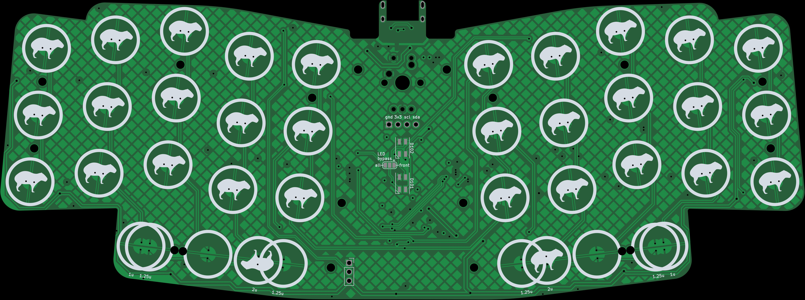
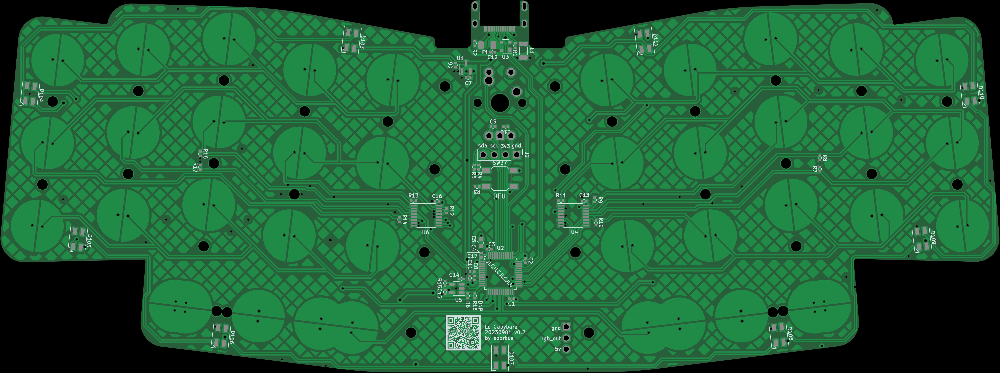

Le Capybara Keyboard
----

Capacitive sensing (aka Topre) keyboard in Le Chiffre layout

## Status
- Prototype tested. Issues had been fixed. Current CAD files should be fully functional.

## Misc
#### 3D assembly preview
* [online viewer](https://3dviewer.net/#model=https://github.com/sporkus/le_capybara_keyboard/blob/dev/documentation/le_capybara-3D.step)
* [step assembly](./documentation/le_capybara-3D.step)

#### PCB Renders

#### Interactive BoM
Download and open this [html](./documentation/le_capybara-ibom.html) locally

#### Schematic
[pdf](./documentation/le_capybara-schematic.pdf)

#### Assembly hardware
There are 30 mounting hole to assemble the PCB-switch-plate sandwich. It's more than necessary, 15-20 sets should be more than enough. For each hole, you will need:
- 1x: M2 x 5mm long brass threaded standoff. Commonly found on aliexpress with a 3.2mm diameter.
- 2x: M2 x 3mm low profile screws
