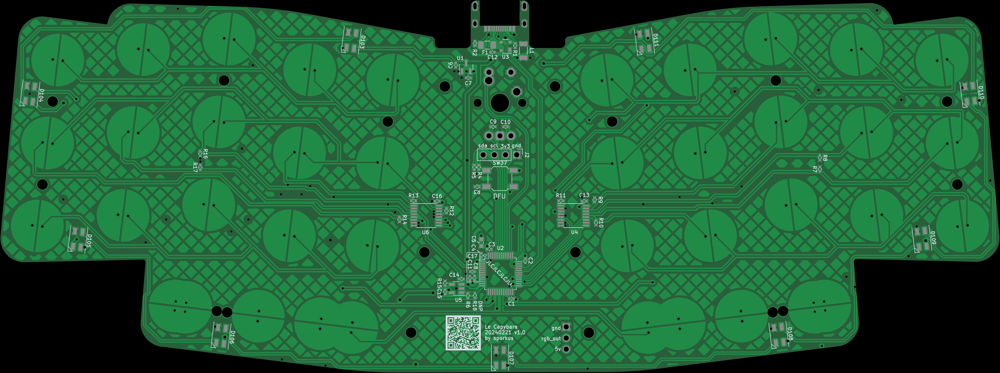

Le Capybara Keyboard
----

Capacitive sensing (aka Topre) keyboard in Le Chiffre layout

## Status
- Prototype tested. Issues had been fixed. Current CAD files should be fully functional.

## Misc
#### 3D assembly preview
* [online viewer](https://3dviewer.net/#model=https://github.com/sporkus/le_capybara_keyboard/blob/dev/documentation/le_capybara-3D.step)
* [step assembly](./documentation/le_capybara-3D.step)

#### PCB Renders

#### Interactive BoM
Download and open this [html](./documentation/le_capybara-ibom.html) locally

#### Schematic
[pdf](./documentation/le_capybara-schematic.pdf)

#### Manufacturing and assembly notes
Plates have 16 m2 threaded holes for securing the plate and switches to the PCB. 16 m2 x 8mm long screws are needed for assembly. DIY tapping is not difficult if your plate manufacturer does not offer tapping services.

Recommended plate material is 1.2mm steel. Plate files are not adjusted for kerf. They have been used successfully with SendCutSend and LaserBoost without adjustment. JLCPCB is not recommnded for the plates without further testing to adapt to their kerf.

